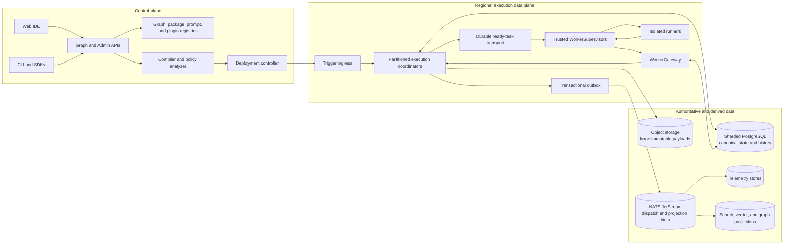
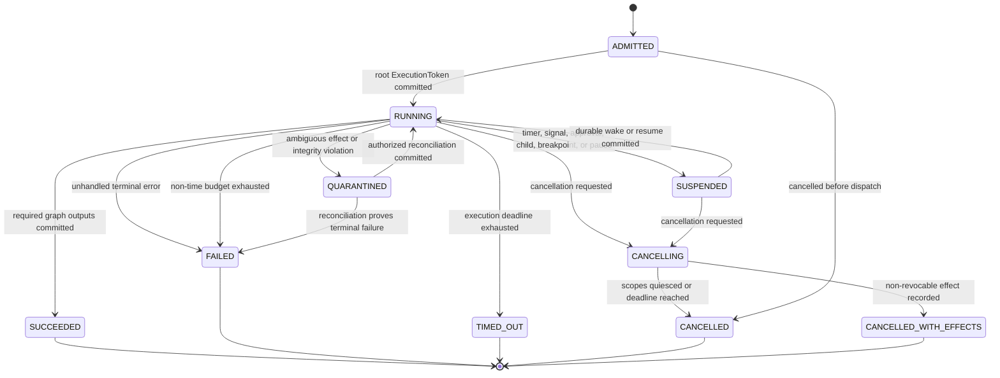

# Production Architecture: Execution Graph Engineering Platform

**Status:** target architecture and implementation blueprint  
**Audience:** senior engineers, architects, SRE, security, product engineering  
**Scale envelope:** 1 million stored graphs; 100 million retained executions; thousands of concurrent organizations; multi-provider LLM, tool, and data access  
**Architecture rule:** a published graph version is an immutable program. Every execution is bound to one compiled plan, one policy snapshot, and explicit capability and resource budgets.

This is the canonical entry point for the architecture. The linked chapters are normative parts of the same document, not optional background material.

The [requirements traceability matrix](REQUIREMENTS-TRACEABILITY.md) preserves every item in the design brief and maps it to implementation evidence.

### Canonical entity names

`DraftBranch` is the collaborative mutable document; `GraphVersion` is an immutable committed GraphSpec; `CompiledPlan` is the immutable semantic IR produced from a GraphVersion; `DeploymentRevision` is an immutable environment binding and traffic decision; `Execution` is one run pinned to a CompiledPlan. Some implementation chapters use the prose phrase “graph revision”; unless explicitly prefixed by `Draft`, it means the `GraphVersion` entity and does not introduce a second version concept.

`Activation` is one logical node occurrence in an execution. `ExecutionToken` is the durable schedulable record for an activation; it is not a bearer credential. `Attempt` is one worker lease of that token, fenced by the monotonically increasing `fencing_token`. `ExecutionGrant` is the short-lived, proof-of-possession and mTLS-bound signed capability minted for that attempt. A generic “task” in diagrams or protocol commentary means the delivery/lease of an ExecutionToken, and a “lease epoch” means its persisted `fencing_token`. The `Scheduler` is the partition-owning service; the `Coordinator` is its per-execution deterministic interpreter role. `Plan IR` and `typed Graph IR` are serialized forms of the `CompiledPlan`.

`NodeInstance` is a configured node in a GraphVersion. Runtime prose such as `NodeExecution` or `node_run` refers to an `Activation`; `NodeAttempt` is the concrete `Attempt`. `PolicyRevision` is an immutable policy artifact, while `PolicySnapshot` is the content-addressed effective combination of policy revisions, environment/tenant bindings, and revocation epoch pinned to an execution.

## 1. Architecture contract

The platform consists of an authoring control plane, a compilation and deployment plane, and one or more isolated execution data planes. It is not a chatbot and does not treat a prompt as the unit of deployment. The deployed unit is a content-addressed execution plan with typed ports, explicit control flow, bounded loops, pinned dependencies, policy decisions, and replay semantics.



### 1.1 Non-negotiable invariants

1. **Immutable deployment:** an execution references `graph_version_id`, `compiled_plan_id`, `plan_hash`, `policy_snapshot_id`, `dependency_lock_hash`, and `worker_compatibility_set`. Publishing creates a version; it never mutates one.
2. **Canonical authority:** PostgreSQL is authoritative for graph metadata, deployments, execution status, event history, state versions, checkpoint and artifact manifests, approvals, idempotency records, and the transactional outbox. Encrypted object storage is authoritative for the immutable large payload bytes referenced by those manifests. Queues, caches, search, vector, knowledge-graph, and telemetry stores are rebuildable or reconcilable projections.
3. **Recorded nondeterminism:** time, randomness, model responses, tool results, human decisions, dynamic graph expansions, routing choices, and external event payloads enter execution only as recorded history events.
4. **No false exactly-once claim:** task delivery is at-least-once. A fenced state-transition transaction makes completion logically once per attempt. External side effects require an idempotency key, a prepare/commit protocol, or an explicit “effect may repeat” contract.
5. **Authorization precedes access:** every graph, secret, state field, artifact, log, retrieval candidate, tool call, and outgoing network route is authorized for the execution principal and tenant before use. Search/vector/knowledge-graph projections never grant access.
6. **Bounded autonomy:** every loop and dynamic expansion has iteration, time, cost, token, node-count, and side-effect bounds. Budget exhaustion is a normal terminal outcome, not an infrastructure crash.
7. **Audit separation:** operational logs can expire; the append-only security and decision audit trail follows independent retention, integrity, and legal-hold policy.
8. **Payload indirection:** database rows and queue messages contain small typed values and content-addressed artifact references. Large prompts, responses, files, and snapshots live in encrypted object storage.
9. **Versioned semantics:** compiler version, expression language, schema dialect, node contract, provider adapter, plugin ABI, and replay compatibility are all explicit.
10. **Fail closed:** an unavailable policy engine, uncertain capability grant, stale approval, invalid schema, expired lease, or unknown plugin signature cannot become an authorized action.

### 1.2 Correctness model

The runtime separates three concerns that are often incorrectly collapsed:

| Concern | Guarantee | Mechanism |
|---|---|---|
| State transition | Serial, durable, logically once | row/partition ownership, monotonic event sequence, MVCC state version, unique transition key |
| Task dispatch | At-least-once | durable outbox, partitioned transport, visibility deadline, retry |
| External effect | Adapter-specific | deterministic idempotency key; provider idempotency; or prepared effect plus approval/commit |
| Read model | Eventually consistent | outbox-fed projection with per-execution watermark and reconciliation |
| Replay | Same recorded decisions, not repeated effects | history-driven interpreter and result substitution |

An activity completion is accepted only when all of these values match canonical rows and the lease has not expired according to database time:

```text
(tenant_id, environment_id, routing_epoch, execution_id, scheduler_fence,
 activation_id, execution_token_id, attempt_id, attempt_ordinal,
 fencing_token, plan_hash, lease_expires_at > database_now())
```

Late, duplicated, or stolen-worker completions are retained as diagnostic events but cannot mutate execution state.

## 2. System decomposition

### 2.1 Control-plane services

| Service | Owns | Does not own |
|---|---|---|
| Identity and organization | users, service accounts, organizations, memberships, SSO/SCIM bindings | runtime task identity |
| Project and graph registry | projects, drafts, commits, immutable graph versions, tags | running state |
| Compiler | parsing, typing, control-flow validation, capability analysis, plan IR, fingerprints | task dispatch |
| Policy and authorization | RBAC/ABAC policy, deployment admission, capability grants | secrets plaintext |
| Package/plugin registry | signed manifests, dependency locks, compatibility metadata, revocation | executing untrusted code |
| Prompt/model registry | immutable prompt templates, model aliases, routing policies, eval status | provider invocation |
| Deployment controller | environment promotion, traffic policy, rollback pointer | in-flight execution mutation |
| Secrets broker | references, envelope metadata, short-lived delivery | graph-visible secret values |
| Billing and quota | plans, credit ledger, reservations, usage settlement | raw provider credentials |
| Collaboration service | draft CRDT operations, presence, comments | published version semantics |

The first implementation SHOULD be a modular control-plane application with isolated modules and a shared PostgreSQL cluster, not dozens of premature microservices. Separate services when scaling, isolation, ownership, or regulatory boundaries require it. The execution coordinator and sandbox runner are separate from day one because their failure and trust boundaries are different.

### 2.2 Execution data-plane services

| Component | Responsibility | Partition key |
|---|---|---|
| Trigger ingress | validate trigger, resolve deployment, deduplicate request, reserve quota | tenant + deployment |
| Execution initializer | create execution, pin plan/policy, write first event and state | execution ID |
| Coordinator | interpret ready control nodes, persist transitions, schedule activities | execution ID |
| Timer service | durable wakeups and retry timers | time bucket + execution ID |
| Ready-task dispatcher | publish committed ExecutionToken outbox hints | queue/capability class |
| WorkerGateway | authenticate supervisors; claim/heartbeat/complete tokens; perform all fenced worker-originated completion, state, budget, and effect mutations | execution token ID |
| WorkerSupervisor | consume JetStream hint, call WorkerGateway, broker artifacts/capabilities, supervise runner | capability + region |
| Sandbox runner | execute customer/plugin code under CPU, memory, filesystem, syscall, and network policy; propose results/intents only | isolated invocation |
| Event correlator | match webhook/message/signal to suspended execution | tenant + correlation key |
| Artifact service | signed upload/download, scanning, encryption, retention | tenant + content hash |
| Projection workers | build telemetry, search, vector, graph, and billing views | event partition |

### 2.3 Compiler pipeline

```mermaid
flowchart LR
    S["GraphSpec source"] --> P["Parse and schema validate"]
    P --> N["Normalize IDs, defaults, and expressions"]
    N --> T["Port and state type checking"]
    T --> C["Control-flow and cycle analysis"]
    C --> E["Effect and capability analysis"]
    E --> B["Budget and termination analysis"]
    B --> X["Static subgraph expansion"]
    X --> I["Canonical Plan IR"]
    I --> H["Plan hash and dependency lock"]
    H --> A["Policy admission and publish"]
```



Compilation MUST reject implicit cycles, unbound required inputs, ambiguous merges, unreachable required outputs, secret-to-public data-flow violations, unbounded graph expansion, incompatible plugins, missing compensation/idempotency declarations for protected effects, and schemas unsupported by the target worker set.

The runtime interprets Plan IR, never the mutable editor document. Editor-only layout, comments, selections, and CRDT metadata are preserved in the source version but excluded from the semantic plan hash.

## 3. End-to-end execution protocol

```mermaid
sequenceDiagram
    autonumber
    participant C as Client or trigger
    participant I as Trigger ingress
    participant DB as Canonical PostgreSQL
    participant O as Outbox relay
    participant Q as Ready-task transport
    participant W as Trusted WorkerSupervisor
    participant G as WorkerGateway
    participant R as Isolated runner/provider
    C->>I: Start(deployment, input, idempotency_key)
    I->>I: Authenticate, authorize, validate, reserve quota
    I->>DB: TX insert execution, state v0, ExecutionAdmitted event, outbox
    DB-->>I: execution_id and status
    I-->>C: 202 Accepted
    O->>DB: Lease unpublished outbox rows
    O->>Q: Publish non-authoritative dispatch hint
    O->>DB: Mark publish result
    W->>Q: Consume dispatch hint
    W->>G: ClaimExecutionToken(token, readiness_generation, outbox_id)
    G->>DB: CAS claim; validate routing/scheduler epochs; increment fencing_token
    DB-->>G: committed lease
    G-->>W: lease + supervisor-only ExecutionGrant
    W->>R: Invoke with sanitized context and opaque capability handles
    loop Until terminal or suspended
        W->>G: HeartbeatExecutionToken + progress/usage
        G->>DB: Validate epochs/fence/expiry; extend lease
    end
    R-->>W: Typed result or classified error
    W->>G: CompleteExecutionToken(result, intents, receipts)
    G->>DB: TX validate epochs/fence/expiry/plan, append event, patch state, create successors/outbox
    DB-->>G: Completion accepted
    G-->>W: committed versions
    W->>Q: Acknowledge delivery
```

The WorkerSupervisor and sandbox never receive database credentials. The sandbox also receives neither JetStream credentials nor the ExecutionGrant; it uses supervisor-brokered opaque capability handles. If the supervisor dies after the database commit and before acknowledging the queue, redelivery observes the completed transition through WorkerGateway and acknowledges without reapplying it. If it dies after an external effect and before recording success, the adapter uses the same deterministic idempotency key and canonical request hash on retry; providers without enforceable idempotency support MUST be declared repeatable, protected by human confirmation, or stopped as `UNKNOWN_EFFECT` for reconciliation.

### 3.1 Execution terminal outcomes



Admission rejection returns a typed API/idempotency decision and creates no `Execution`; `ADMITTED` is the first persisted execution state. `FAILED` means the graph's declared error policy could not handle an error; `terminal_reason_code` distinguishes cost/token/expansion budget exhaustion from domain and infrastructure failure. `TIMED_OUT` is reserved for the execution deadline. `SUSPENDED` carries a typed suspension reason rather than creating separate lifecycle states for every wait or debugger mode. `QUARANTINED` is non-terminal and requires an authorized reconciliation. Forced administrative termination follows cancellation semantics and ends as `CANCELLED` or `CANCELLED_WITH_EFFECTS`. Cancellation is cooperative until a deadline, after which runner processes are killed and unresolved non-idempotent effects are surfaced for reconciliation.

## 4. Cross-cutting platform contracts

### 4.1 Identity propagation

Every request carries two distinct identities:

- `actor`: the human or service account that initiated or approved the operation;
- `execution_principal`: the short-lived, least-privilege identity granted to this deployment and execution.

The ExecutionGrant is a proof-of-possession and mTLS-bound signed capability containing tenant, environment, home cell, routing epoch, execution, ExecutionToken, attempt, scheduler fence, fencing token, plan hash, permitted node capability IDs, approved tool/resource scopes, network egress class, data classification ceiling, budget reservation, and expiration. It MUST NOT contain provider secrets or authorize a direct database, broker, secret, or adapter connection. WorkerGateway mints it, persists its canonical claim hash, and validates it on every supervisor RPC; only WorkerGateway and the trusted WorkerSupervisor see it. The durable ExecutionToken row contains scheduling and lease metadata but no provider credentials; the sandbox receives narrower opaque capability handles.

### 4.2 Data classification propagation

Version 1 ports and state paths declare exactly `PUBLIC`, `INTERNAL`, `CONFIDENTIAL`, or `RESTRICTED`. Tenants express finer handling through policy tags/labels without inventing incompatible wire-level classification values. The compiler computes a conservative label join across edges. Declassification requires an explicit policy node and auditable policy decision. Logs default to metadata-only for confidential values; values are represented by length, schema, hash, and encrypted artifact reference.

### 4.3 Budget reservation and settlement

Start admission reserves a tenant budget envelope. A coordinator atomically grants child node reservations before dispatch. Workers report metered usage with provider request IDs. The ledger distinguishes estimated, reserved, incurred, refunded, and disputed amounts. A retry cannot receive a new reservation until the prior attempt is settled or expired. Budget checks occur before scheduling, before a costly invocation, and during streaming.

### 4.4 Artifact contract

```json
{
  "artifact_id": "019fd4b4-1000-7000-8000-000000000021",
  "tenant_id": "019fd4b4-1000-7000-8000-000000000001",
  "content_sha256": "sha256:8f2c...",
  "media_type": "application/json",
  "size_bytes": 482190,
  "classification": "CONFIDENTIAL",
  "encryption_key_ref": "kms://tenant/key-version/7",
  "object_version": "3Lg...",
  "created_by_execution": "019fd4b4-1000-7000-8000-000000000101",
  "retention_policy_id": "019fd4b4-1000-7000-8000-000000000031",
  "scan_status": "CLEAN"
}
```

Consumers verify the hash after download. Artifact references are authorized at dereference time; possession of an ID or URL is not authority. Signed URLs are single-purpose and short-lived.

## 5. Deployment topology

Placement authority is keyed by `(tenant_id, environment_id)` and a routing epoch. Each execution pins that environment assignment and remains in one writable home region/cell for its lifetime. Stateless API traffic can enter through any region, but mutation routes to the pinned home region. Cross-region active/active ownership of a single environment or execution is deliberately avoided because it adds consensus latency and ambiguous effect ordering. Organization policy selects allowed home regions and replication destinations.

```text
Global DNS / anycast
  |
  +-- Global control-plane routing and tenant directory
  |
  +-- Region A -----------------------------------------------+
  |    API | compiler cache | coordinators | workers          |
  |    PostgreSQL shards (writer + synchronous AZ standby)    |
  |    object store | event transport | telemetry gateway     |
  |                                                         async encrypted replication
  +-- Region B -----------------------------------------------+
       API | compiler cache | coordinators | workers          |
       PostgreSQL shards (writer + synchronous AZ standby)    |
       object store | event transport | telemetry gateway     |
```

Regional failure stops new mutations for affected executions until the tenant's recovery policy promotes a replica. Promotion increments the environment routing epoch and placement fence. Workers holding the old tuple can no longer commit. RPO/RTO classes, recovery drills, and exact limitations are specified in Chapter 11.

## 6. Complete chapter map

| Brief area | Normative chapter |
|---|---|
| Platform vision and terminology | [01 — Platform vision](chapters/01-platform-vision.md) |
| Runtime, scheduling, recovery, replay, distributed execution | [02 — Runtime architecture](chapters/02-runtime-architecture.md) |
| Graph elements, scopes, variables, versions, reusable components | [03 — Graph model and state](chapters/03-graph-model-and-state.md) |
| Every built-in and custom node family | [04 — Node system](chapters/04-node-system.md) |
| Global/local/shared state, MVCC, synchronization, streaming | [05 — Shared state protocol](chapters/05-shared-state.md) |
| Retry, reflection, critic, planning, repair, evaluation loops | [06 — Loop engineering](chapters/06-loop-engineering.md) |
| Complete product IA, graph editor, inspectors, collaboration | [07 — Product UX](chapters/07-product-ux.md) |
| CLI, SDK, APIs, DSL, debugging, local runtime, tests | [08 — Developer experience](chapters/08-developer-experience.md) |
| Metrics, traces, logs, cost, timeline, profiler, replay, audit | [09 — Observability](chapters/09-observability.md) |
| Identity, policy, secrets, isolation, prompt/tool security, compliance | [10 — Security and governance](chapters/10-security-governance.md) |
| Million-graph / hundred-million-execution scaling, HA, DR | [11 — Scalability and reliability](chapters/11-scalability-reliability.md) |
| Model routing, retrieval, agents, evaluation, graph optimization | [12 — AI intelligence](chapters/12-ai-intelligence.md) |
| Plugin SDK, registry, signing, compatibility, sandbox, marketplace | [13 — Plugin system](chapters/13-plugin-system.md) |
| ERD and runtime, graph, execution, state, audit, metrics schemas | [14 — Data model](chapters/14-data-model.md) |
| Production monorepo structure | [15 — Repository structure](chapters/15-repository-structure.md) |
| Technology choices and deployment stack | [16 — Technology stack](chapters/16-technology-stack.md) |
| Decision records, alternatives, trade-offs, failure and operations | [17 — Engineering decisions](chapters/17-engineering-decisions.md) |

## 7. Delivery slices and acceptance gates

The architecture is implemented as vertical slices. A slice is accepted only when its replay, authorization, failure injection, telemetry, and upgrade behavior are tested—not when a UI path merely appears to work.

| Slice | Capability | Required acceptance evidence |
|---|---|---|
| 0 | GraphSpec parser/compiler and local interpreter | canonical plan hashes; type/control-flow diagnostics; deterministic replay corpus |
| 1 | Durable single-region runtime | crash-at-every-transition tests; lease fencing; idempotent redelivery; checkpoints and timers |
| 2 | Core authoring IDE and registry | draft collaboration; publish immutability; diff; source-to-plan diagnostics; RBAC |
| 3 | Sandboxed function/plugin/tool execution | syscall/network/secret denial tests; signatures; quotas; artifact scanning |
| 4 | LLM, prompt, retrieval, memory, and evaluation | provider fallback records; injection tests; schema-constrained output; cost budgets |
| 5 | Human approval and protected effects | content-bound approvals; expiry/revalidation; effect ledger; reconciliation UI |
| 6 | Partitioned scale and multi-AZ operations | load and skew tests; backpressure; resharding; zonal failover; SLO dashboards |
| 7 | Multi-region and enterprise controls | tenant residency; regional fencing; restore drills; SSO/SCIM; audit export/legal hold |
| 8 | Marketplace and optimization assistant | signed supply chain; compatibility rollback; eval-gated suggestions; provenance |

### 7.1 Release-blocking system tests

- Kill coordinator, worker, queue connection, database connection, and sandbox at every durable boundary; prove no accepted transition is lost or applied twice.
- Replay every fixture across the previous and candidate runtime build; report incompatible histories before rollout.
- Attempt cross-tenant access through canonical reads, logs, artifacts, caches, search, vector retrieval, graph traversal, correlation keys, and support tooling.
- Expire or revoke a token during a streaming model response and a tool call; prove further effects stop and the outcome is unambiguous.
- Exhaust time, cost, token, state-size, fan-out, and loop bounds independently; prove bounded terminal outcomes.
- Exercise provider timeouts before request, after provider acceptance, during stream, and after response; verify adapter-specific idempotency and reconciliation.
- Restore the canonical database and object manifests into an empty region, then rebuild queues and every projection from outbox/history.
- Upgrade compiler, worker, plugin ABI, node contract, and state schema with old executions in flight; prove pinned compatibility and rollback.

## 8. Explicit non-goals for the first production release

- Arbitrary cross-region writes to one execution.
- Transparent exactly-once behavior for providers that expose neither idempotency nor transactions.
- Allowing generated graphs or self-modifying agents to bypass compile, policy, evaluation, or publish gates.
- Treating event transport, Redis, ClickHouse, a vector database, or a knowledge graph as execution authority.
- Running untrusted plugins in the coordinator process.
- Maintaining live-edit semantics for an already-started execution. A fork or migration creates a new, explicit lineage.

These exclusions constrain risk; they do not prevent later compatible extensions.

## 9. Machine-readable starting contracts

The prose and these contracts must evolve together. CI treats a breaking contract change as an architecture change requiring compatibility evidence.

| Contract | Purpose |
|---|---|
| [GraphSpec JSON Schema](contracts/graph-spec.schema.json) | Strict source graph envelope, typed ports, nodes, edges, state paths, effects, budgets, and package pins |
| [Control-plane OpenAPI](contracts/control-plane.openapi.yaml) | Version/publication, deployment, start, inspect, cancel, signal, history, and approval APIs |
| [Execution-event AsyncAPI](contracts/execution-events.asyncapi.yaml) | At-least-once tenant lifecycle projection and event envelope |
| [Execution-history event JSON Schema](contracts/execution-history-event.schema.json) | Canonical PostgreSQL-backed history event envelope consumed by replay and the REST history API |
| [WorkerGateway Protobuf](contracts/executiongraph/runtime/v1/runtime.proto) | Supervisor claim, lease/epochs/fences, heartbeat, typed intent, effect receipt, completion, and failure protocol |
| [Sandbox Protobuf](contracts/executiongraph/sandbox/v1/sandbox.proto) | Supervisor-to-runner invocation stream and brokered capability boundary without database, JetStream, secret, or ExecutionGrant access |

The [contract README](contracts/README.md) defines their intended status and code-generation/compatibility requirements.
