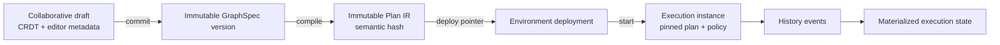

# 1. Platform Vision and Semantic Foundations

## 1.1 Graph Engineering is program engineering for AI execution

Graph Engineering is the discipline of specifying, compiling, testing, executing, and operating a versioned network of typed computation, decision, event, human, and side-effect steps. The graph is not merely a drawing. It is a durable program with control flow, data flow, state ownership, capability requirements, budgets, failure policies, and observable history.

A graph engineer works on four artifacts at once:

1. **Source graph:** the human- and tool-editable GraphSpec, including semantic node/edge definitions and non-semantic editor metadata.
2. **Compiled plan:** normalized immutable IR with resolved dependencies, static expansions, capability/effect analysis, schemas, budgets, and a content hash.
3. **Execution history:** an append-only sequence of admitted decisions and external observations.
4. **Materialized state:** a versioned projection of history used for efficient scheduling, inspection, and recovery.

The platform must preserve the relationship among all four. A canvas without a compiler is a diagramming tool. A scheduler without source/version lineage is an opaque automation service. A history without deterministic interpretation is only a log.

## 1.2 Why graphs supersede isolated prompt engineering

Prompt text controls one probabilistic transformation. Production AI systems require multiple transformations plus retrieval, validation, tools, approvals, compensation, branching, concurrency, memory, and explicit termination. These concerns exist even if every prompt is excellent.

Prompt-only systems fail operationally because they hide:

- when and why an action was selected;
- which data, model, prompt, policy, tool, and code version produced it;
- where authorization was applied;
- how partial work resumes after a crash;
- how cost and latency budgets propagate across parallel work;
- whether a retry repeats a real-world effect;
- how a human approval is bound to the exact proposed action;
- how to test a change without silently changing every downstream outcome.

Execution graphs make these properties explicit and mechanically enforceable. Prompt engineering remains important inside prompt/LLM nodes; it ceases to be the architecture.

## 1.3 Concept baseline and deliberate extensions

The informative concept baseline for this platform is AI Builder Club's
[Graph Engineering Guide (2026)](https://www.aibuilderclub.com/blog/graph-engineering-guide-2026),
accessed 2026-08-22. The guide supplies the plain-language model and the
right-sizing principle. This repository's versioned contracts and invariants remain
normative for implementation. A live external article cannot silently change a
released runtime contract.

### 1.3.1 Five cumulative AI-engineering layers

| Layer | Primary artifact | Core responsibility | Platform treatment |
|---|---|---|---|
| Prompt Engineering | instruction/template, examples, output contract | ask one model transformation clearly | immutable prompt versions, schemas, evaluations and lineage |
| Context Engineering | selected evidence, memory, tools and state projection | give the model the authorized information it needs | context manifests, authorized retrieval, compression and budgets |
| Harness Engineering | tools, memory, orchestration, state, evaluation and recovery around one agent | let a node act, remember, verify and recover | capability-scoped skills/tools, checkpointed node loop, evaluators, retries and recovery policy |
| Loop Engineering | bounded discover/plan/act/verify policy | repeat one specialty until its stop condition is met | first-class loop scope, budgets, progress metrics and stop reasons |
| Graph Engineering | typed, versioned nodes, edges and shared state | coordinate multiple genuine specialties | compiler, runtime, debugger, deployment, policy and observability |

The layers are cumulative. A graph contains specialized nodes; each agent node owns a
bounded loop; that loop uses a harness; the harness assembles authorized context; and
model calls use versioned prompts. Local `SKILL.md` packages are harness inputs, not
independent runtime authority. A selected skill contributes instructions and declared
resources to a node's context, while the runtime still controls tools, effects, budgets,
state writes and cancellation.

```text
Graph Engineering
  controls specialties, edges, shared state, concurrency and handoffs
  +-- Node Loop
      controls iteration, verification, stopping and budgets
      +-- Harness
          controls tools, skills, memory, orchestration, state and recovery
          +-- Context Engineering
              controls evidence selection, authorization and compression
              +-- Prompt Engineering
                  controls model instructions and output contract

Operations Engineering surrounds every layer with SLOs, capacity, incidents,
deployment, audit and disaster recovery.
```

Operations Engineering is therefore a deliberate production-platform extension, not a
replacement for the guide's Harness layer.

### 1.3.2 Loop-first and graph-right-sizing gate

A multi-node graph is not the default. Before compilation, the authoring assistant MUST
test whether one well-scoped node loop with an independent verifier can satisfy the
objective. It MUST recommend the simpler loop when splitting the work would add no real
specialty, tool/model boundary, parallel fan-out/join, auditable handoff, independent
reviewer or failure-isolation benefit.

When a graph is justified:

1. every agent node MUST name one real specialty and its success verifier;
2. the proposed edges MUST show sequential, conditional, fan-out, fan-in and loop-back
   behavior explicitly rather than hiding routing in a prompt;
3. shared state fields and writer authority MUST be designed before execution;
4. reviewer nodes SHOULD be independent and read-only for the artifacts they judge;
5. node failure, retry, effect and budget boundaries MUST be isolated; and
6. the plan MUST have hard iteration, time, token and cost bounds.

An author may begin with unrelated intent nodes such as frontend, API, backend and
database concerns. Those boxes are an **intent map**, not yet an executable graph. The
planner may propose specialties, edges and shared-state contracts, but execution begins
only after the user reviews the semantic diff and approves an immutable compiled plan.

## 1.4 Workflow, execution graph, state machine, DAG, and knowledge graph

### Workflow

A workflow is the business-level coordination of work toward an outcome. It may include people, policies, timers, systems, and exceptions. “Approve and fulfill a refund” is a workflow. A workflow definition can be implemented by one or more execution graphs, manual procedures, or external systems.

### Execution graph

An execution graph is the deployable computational representation. Nodes are typed operations or control constructs; edges transport data, control, errors, events, or cancellation. It may contain cycles, dynamically expanded fragments, nested subgraphs, streaming channels, and long-lived waits. Each running graph creates execution-specific node instances and history.

### State machine

A state machine defines legal states and event-triggered transitions. The execution runtime itself is a state machine; an individual node also has one. A state machine is ideal for lifecycle correctness but does not by itself express rich data-flow topology or parallel computation. The compiler lowers graph constructs into state-machine transitions plus schedulable activities.

### Directed acyclic graph (DAG)

A DAG is a graph with no directed cycles. It supports static topological scheduling and is useful for batch/data pipelines. An execution graph may contain DAG regions, but explicit loop gateways and event-driven recurrence make the whole program cyclic. Pretending a loop is repeated DAG submission loses one coherent history, scope, and budget unless the relationship is explicitly modeled.

### Knowledge graph

A knowledge graph represents entities, facts/assertions, and relationships for query and reasoning. It is data consumed or produced by an execution graph, not the execution control structure. A “customer —placed→ order” edge does not mean the runtime should schedule the order. A knowledge-graph query node can read an authorized projection; it does not make that projection the runtime authority.

### Comparison by semantics

| Property | Workflow | Execution graph | State machine | DAG | Knowledge graph |
|---|---:|---:|---:|---:|---:|
| Business intent | primary | encoded | possible | weak | contextual |
| Executable topology | optional | primary | transition table | primary | no |
| Cycles | possible | explicit/bounded | natural | forbidden | common |
| Parallel data flow | possible | first-class | awkward | first-class | query-dependent |
| Durable lifecycle | process-dependent | required | first-class | engine-dependent | not applicable |
| Facts/relationships | incidental | values/state | state labels | datasets | primary |
| Versioned deployment | optional | required | implementation-specific | common | schema/data versioning |

## 1.5 Source graph, plan graph, and execution graph instance

The term “graph” has three representations. Confusing them causes live-edit and replay bugs.



- Draft operations can be concurrent and reversible.
- A commit freezes one GraphSpec revision.
- Compilation is pure for the same source, dependency lock, compiler version, and policy inputs.
- A deployment points traffic at one or more compiled plans with deterministic routing weights.
- An execution pins the selected plan for its lifetime. Editing or redeploying does not mutate it.
- Migrating a suspended execution requires an explicit, validated state-and-history migration and creates lineage events.

## 1.6 Platform product surface

The platform integrates five roles without conflating their authority:

| Role | Primary operations | Required guardrail |
|---|---|---|
| Graph developer | author, compile, simulate, test, propose version | cannot self-approve protected production changes unless policy allows |
| Platform engineer | operate runtime, pools, policies, packages, deployments | support access is tenant-scoped and audited |
| Security/governance | define capabilities, policies, classifications, audit/export | cannot alter execution history silently |
| Business operator/approver | inspect proposal/evidence and approve/deny | approval binds exact hashes and expires |
| Auditor/analyst | query lineage, history, cost, controls and outcomes | read access respects tenant, purpose and legal hold |

The UI, CLI, SDK, and API expose the same domain model. The web editor is not a privileged bypass; it calls public versioned APIs and receives the same policy diagnostics as CI.

## 1.7 Architectural properties by design

### Determinism envelope

The coordinator is deterministic over `(compiled_plan, prior_history)`. Activities are deliberately nondeterministic but their request and result are recorded. On replay, the coordinator substitutes recorded results rather than re-invoking activities. A runtime upgrade must prove replay compatibility against retained history fixtures.

### Effect awareness

Every node declares an effect class:

```text
PURE
READ_ONLY
IDEMPOTENT_WRITE
COMPENSATABLE_WRITE
NON_IDEMPOTENT_WRITE
HUMAN_EFFECT
```

The compiler and policy engine use this class to require retries, idempotency keys, approval, compensation, or manual reconciliation. “REST API node” is not a sufficient effect declaration; the configured operation determines the class.

### Capability awareness

Nodes request structured capabilities rather than matching colon-delimited strings. Examples are `{action: "network.connect", resource: {kind: "network_destination", id: "vendor-api"}, constraints: {methods: ["POST"]}}`, `{action: "secret.read", resource: {kind: "secret_binding", id: "billing-key"}, constraints: {version: 7}}`, and `{action: "tool.invoke", resource: {kind: "mcp_tool", id: "crm/create_case"}, constraints: {maxCalls: 1}}`. A deployment policy grants a narrowed set. Runtime grants contain only the normalized intersection:

```text
effective capabilities = node request
                       ∩ graph package declaration
                       ∩ environment policy
                       ∩ tenant policy
                       ∩ initiating principal delegation
                       ∩ approval grant
```

### Durable suspension

Waiting for a timer, event, human, rate limit, child graph, or provider callback consumes no worker. The coordinator commits a wait subscription and wake condition, releases compute, and resumes from history when the matching event is durably correlated.

### Explainability without invented reasoning

The platform records declared decision inputs, routing scores, policy decisions, evidence references, model/tool requests and outputs (subject to redaction), validators, and graph paths. It does not claim to expose hidden model chain-of-thought. User-visible explanations are generated from recorded, reviewable facts.

## 1.8 Success criteria

The platform succeeds when teams can answer, mechanically and quickly:

1. What immutable program and dependency set ran?
2. Who or what initiated it, under which delegated authority?
3. What data, context, model, prompt, tools, code, and policies were used?
4. Which branches and loop iterations executed, and why?
5. Which external effects may have occurred, with what idempotency/reconciliation state?
6. Can the execution resume after any single process or zone failure?
7. Can its coordinator decisions be replayed without repeating effects?
8. What did it cost, how long did each segment take, and what was the critical path?
9. Can a proposed change be diffed, simulated, evaluated, canaried, rolled back, and audited?
10. Can every derived index be rebuilt from canonical records without loss of authority?

If any answer depends on a developer reading unstructured logs, guessing which prompt was current, or trusting a queue/cache as truth, the architecture is incomplete.
