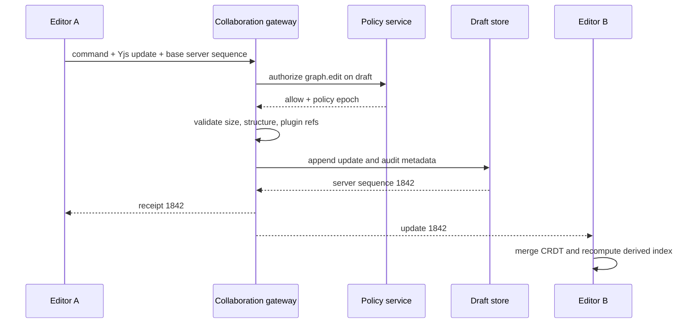

# 7. Product UX

## 7.1 Product model

The web application is an engineering workbench, not a canvas with administration pages bolted on. It exposes four connected objects:

```text
Organization
  +-- Project
      +-- Graph
          +-- Draft branch (collaborative and mutable)
          +-- Graph version (published and immutable)
              +-- Deployment (version + environment bindings)
                  +-- Execution
                      +-- Node attempt / checkpoint / artifact / trace
```

Users always see the active organization, project, environment, and graph version. Production data cannot be mistaken for a local simulation: environment uses both a textual badge and a distinct icon, never color alone. Draft, published, deployed, and historical execution views have different write affordances.

### 7.1.1 Global shell

The shell contains:

- a skip link, organization/project switcher, environment indicator, breadcrumb, global command palette, notifications, help, and user menu;
- a permission-filtered primary navigation; hidden actions do not replace server authorization;
- a route-owned page header with resource status, immutable version/digest where relevant, primary action, and overflow actions;
- a persistent operations drawer for long jobs such as imports, simulations, deployments, and plugin scans;
- a global `Cmd/Ctrl+K` palette that searches resources and exposes only commands available in the current scope.

Routes encode stable IDs, not display names. The last-selected organization/project is convenience state only; every request carries an explicit scope.

## 7.2 Information architecture

| Page | Route | Primary job and information | High-value actions | Minimum authority |
|---|---|---|---|---|
| **Dashboard** | `/o/:orgId/p/:projectId` | Environment health, active incidents, execution SLOs, spend, recent graph changes, failed approvals | Resume work, inspect anomaly, start graph, open incident | `project:view`; cards filter by narrower permissions |
| **Projects** | `/o/:orgId/projects` | Project ownership, environment coverage, quotas, recent activity | Create, archive, transfer, configure retention | `project:list`; mutations require project admin |
| **Graphs** | `/o/:orgId/p/:projectId/graphs` | Searchable graph catalog with latest version, deployment state, owner, validation and run health | Create/import, branch, compare, publish, deploy | `graph:view`; action-specific write/deploy rights |
| **Executions** | `/o/:orgId/p/:projectId/executions` | Filterable execution table and live status; saved views by graph/version/status/tag/time | Start, cancel, replay, fork-from-checkpoint, export evidence | `execution:view`; artifacts/logs separately authorized |
| **Templates** | `/o/:orgId/templates` | Curated graph blueprints, required bindings, compatibility, provenance | Preview, instantiate, publish organization template | View or template publisher |
| **Marketplace** | `/marketplace` | Signed public/private plugin and template catalog, trust scorecards, compatibility and permissions | Inspect, request approval, install pinned version | Public browse; install governed per organization |
| **Plugins** | `/o/:orgId/plugins` | Installed versions, dependents, grants, advisories, scan/signature status | Install, upgrade preview, disable, revoke, rollback | Plugin administrator; security can revoke |
| **Settings** | `/o/:orgId/p/:projectId/settings` | Project defaults, environments, retention, quotas, feature policies | Change with impact preview and audit reason | Project admin |
| **Users** | `/o/:orgId/users` | Members, groups, effective role/attributes, invitations, last activity | Invite, suspend, change memberships, inspect effective access | Organization identity admin |
| **Organizations** | `/organizations` | Organizations the principal can access; residency and plan summary | Create/request access/switch | User scope; creation policy-controlled |
| **Audit Logs** | `/o/:orgId/audit` | Immutable actor/action/resource/result trail with signed export | Filter, correlate, export evidence, verify chain | Auditor; sensitive details need separate grant |
| **Secrets** | `/o/:orgId/p/:projectId/secrets` | Secret metadata, scope, provider, rotation age, consumers—not values | Create reference, rotate, disable, view dependents | Secret admin; using and managing are distinct |
| **Billing** | `/o/:orgId/billing` | Plan, budgets, usage attribution, invoices, forecast and limit events | Set budget/alerts, export, manage plan | Billing role |
| **Models** | `/o/:orgId/models` | Model providers/routes, health, residency, price cards, policy eligibility | Test route, configure fallback, enable/disable | Model admin; credentials via Secrets |
| **Knowledge** | `/o/:orgId/p/:projectId/knowledge` | Sources, ingestion jobs, chunks, projection/index epochs, access policy | Connect, reindex, inspect provenance, query test | Knowledge admin/viewer split |
| **Memory** | `/o/:orgId/p/:projectId/memory` | Scoped memory records, versions, retention, subject and provenance | Search, inspect, correct via new version, tombstone/export | Purpose- and subject-bound memory grants |
| **API Keys** | `/o/:orgId/api-keys` | Key metadata, scope, last used, expiry; plaintext shown once | Create, narrow, rotate, revoke | Credential admin; self-service keys policy-bound |
| **Observability** | `/o/:orgId/p/:projectId/observe` | SLOs, rates, latency, cost, queue depth, provider health, trace search | Drill down, compare versions, create alert link | Telemetry viewer; payload access not implied |
| **Documentation** | `/docs/:version/*` | Versioned concepts, node catalog, guides and searchable examples | Copy example, open in playground, report issue | Public or workspace-authenticated by edition |
| **Developer Portal** | `/o/:orgId/developer` | API/SDK versions, schema explorer, webhooks, service accounts, usage | Create app, test request, subscribe event, download spec | Developer role; credentials separately controlled |

Administrative pages show pending policy effects before save—for example, which deployments will fail after a model route is disabled. Bulk changes always present exact target counts and generate one parent audit event plus per-target results.

### 7.2.1 Detail and system routes

The navigation pages above lead to stable detail routes; these are part of the information architecture rather than modal-only states.

| Route | Purpose |
|---|---|
| `/login`, `/auth/callback`, `/logout` | OIDC/SSO entry, callback validation, organization selection, and explicit session termination; return paths are allowlisted |
| `/onboarding/*`, `/invites/:token` | Accessible resumable organization/project onboarding and invitation acceptance without exposing token data after redemption |
| `/o/:orgId/p/:projectId/graphs/:graphId/drafts/:draftId` | Collaborative graph workbench with branch head and autosave receipt |
| `/o/:orgId/p/:projectId/graphs/:graphId/versions/:version` | Immutable version, semantic diff, provenance, validation evidence, deployments and dependency impact |
| `/o/:orgId/p/:projectId/deployments/:deploymentId` | Environment bindings, rollout state, policy decisions, compatibility, rollback plan and affected executions |
| `/o/:orgId/p/:projectId/executions/:executionId` | Execution workbench; selected attempt/checkpoint/view is encoded in non-sensitive query parameters |
| `/o/:orgId/inbox` | Human approvals, access requests, plugin install reviews, policy exceptions and mentions with due/expiry state |
| `/o/:orgId/p/:projectId/connections/:connectionId` | Provider/connector metadata, health, permitted operations and dependents; credentials remain under Secrets |
| `/o/:orgId/operations/:operationId` | Long-running import, compile, deployment, reindex, export or installation progress with retry-safe result links |
| `/o/:orgId/incidents/:incidentId` | Correlated alerts, affected resources, timeline, response ownership and post-incident evidence |
| `/access-denied`, `/not-found`, `/unavailable` | Distinct safe failure routes preserving request ID and a permitted recovery action without disclosing resource existence |

Deep links first resolve organization membership and resource scope, then fetch data. An unauthorized response does not reveal whether a cross-tenant identifier exists. Drawers may accelerate navigation, but refreshing any durable resource view opens the corresponding route.

## 7.3 Graph workbench

### 7.3.1 Layout

```text
+------------------------------------------------------------------------------------------------+
| Org / Project / Graph / Draft       validation: 2 errors   collaborators: 4   Run | Publish      |
+-------------------+--------------------------------------------------------+-------------------+
| Node palette      | Toolbar: select hand edge group comment layout search | Inspector         |
| search + category |                                                        | Node / Edge / Run |
|                   |                    infinite canvas                     |                   |
| Control           |         +------------+       +--------------+          | schema form       |
| AI & retrieval    | input ->| Retriever  |------>| LLM          |-> output | expression editor |
| Integrations      |         +------------+       +--------------+          | policy/resources  |
| Data & state      |                                                        | validation        |
| Installed plugins|                                          [mini map]    |                   |
+-------------------+--------------------------------------------------------+-------------------+
| Problems (2) | Outline | Execution console | Logs | Trace | State | Tests                       |
+------------------------------------------------------------------------------------------------+
```

The center canvas is only one projection. `Outline` provides an accessible tree/table with the same selection, connect, rename, reorder-within-group, and delete commands. `Problems` is the authoritative validation list and links to node, edge, config path, or policy rule.

The editor maintains three models:

1. **Graph document:** semantic nodes, ports, edges, groups, comments, bindings, and editor metadata in the collaborative draft.
2. **Derived index:** adjacency, spatial index, validation facts, type compatibility, search tokens, and collapsed-subgraph projections. It is disposable.
3. **Viewport state:** camera, open panels, local selections, previews, and breakpoint overlay. It is user-local and not versioned unless explicitly saved as a shared view.

For graphs above 2,000 visible nodes, rendering is viewport-virtualized, edges are batched, offscreen labels are elided, validation runs in a Web Worker, and subgraphs collapse by default. Editing remains enabled; the product does not replace the graph with an image.

### 7.3.2 Interaction contract

| Feature | Required behavior |
|---|---|
| Drag-and-drop | Palette drop creates a provisional node, snaps to configurable grid, opens required config, and commits one undo transaction. Dropping on a compatible edge offers insertion; an incompatible drop changes nothing |
| Zoom and pan | Cursor-anchored wheel/pinch zoom from 10–400%; fit selection/graph; space-drag or middle-button pan; UI controls and keyboard equivalents are always available |
| Mini map | Viewport polygon, subgraph/group boundaries, error and running-state markers; clicking moves the viewport; can be disabled for reduced motion or privacy |
| Multi-select | Shift-click, marquee, outline checkboxes, and `Cmd/Ctrl+A`; bulk edit shows only properties safely common to every selection |
| Alignment | Align/distribute against selection bounds; preview guides; entire operation is one semantic command; coordinates never affect executable-plan digest |
| Groups | Visual organization with optional shared policy/resource defaults; moving a group moves members, while deleting asks whether to ungroup or delete contents |
| Subgraphs | Collapse/expand inline; enter scoped editor with breadcrumb; expose only declared interface ports; version-pinned reusable subgraphs cannot be edited in place |
| Comments | Markdown annotation anchored to graph/node/edge with threads, mentions, resolve state, and version provenance; comments never enter execution inputs |
| Live collaboration | Per-user cursor/selection/presence, resilient reconnect, offline draft queue, server-validated mutations, deterministic conflict display |
| Keyboard shortcuts | Discoverable command palette and shortcut sheet; platform conventions; remappable; never shadow browser/assistive technology reserved keys |
| Auto layout | Preview before apply; deterministic by algorithm version and constraints; pinned nodes and group boundaries honored; coordinates change in one transaction |
| Search | Names, IDs, types, config keys, tags, comments, schema fields, and validation issues; result traversal does not alter the graph |
| Graph diff | Semantic additions/removals/config/binding/policy/schema changes separated from layout/comments; impact and compatibility surfaced |
| History | Draft operations with author/time and published versions with immutable digest; restore creates a new draft, never rewrites history |
| Undo/redo | User-local semantic transactions over the shared CRDT; only the initiating user's still-applicable edits are reversed; remote edits are not rewound |
| Copy/paste | Clipboard uses `application/vnd.ege.graph-fragment+json`; IDs regenerate, internal edges remap, external references become unresolved bindings, secrets remain references |
| Version compare | Side-by-side, overlay, and structured list; filter semantic/layout/comments; map nodes by stable ID then explicit rename/move hints |

### 7.3.3 Graph commands

UI components do not mutate the Yjs document directly. They dispatch typed commands through validation and authorization-aware reducers.

```ts
type GraphCommand =
  | { kind: "node.add"; node: NodeInstance; at: Point }
  | { kind: "node.patchConfig"; nodeId: NodeId; patch: JsonPatch; expectedSchema: Digest }
  | { kind: "edge.connect"; edge: EdgeInstance }
  | { kind: "selection.delete"; nodeIds: NodeId[]; edgeIds: EdgeId[] }
  | { kind: "layout.apply"; algorithm: string; positions: Record<NodeId, Point> }
  | { kind: "fragment.paste"; fragment: GraphFragment; origin: Point };

interface CommandReceipt {
  operationId: string;
  appliedDocumentClock: string;
  affectedIds: string[];
  warnings: ValidationFact[];
}
```

Each command performs local structural checks for immediate feedback. The collaboration gateway repeats canonical validation, scope authorization, size/rate limits, and plugin availability before broadcasting. Publication runs the full compiler; local green checks never imply deployability.

### 7.3.4 Connections and edges

Dragging from a port highlights only compatible targets. Compatibility evaluates schema assignability, cardinality, stream versus batch, sensitivity flow, scope, and control/data edge kind. If conversion is possible, the editor offers a concrete converter node and shows whether it is lossy.

The Edge Editor exposes:

- source and target immutable port references;
- data mapping expression with typed autocomplete and preview using redacted fixtures;
- optional condition, priority, buffer/backpressure policy, and error route;
- label, description, breakpoint, and observed traffic overlay;
- compiler facts explaining incompatibility or unreachable paths.

Edges cannot contain arbitrary executable JavaScript. Expressions compile to the restricted graph expression AST. Deleting a port with attached edges is a schema-breaking node change and is handled in the node-definition/plugin flow, not silently by the graph editor.

### 7.3.5 Node Editor

Selecting a node opens these inspector sections:

1. **Contract:** pinned definition/version/digest, typed ports, documentation, provenance and upgrade availability.
2. **Inputs:** edge bindings, graph/state expressions, constants, fixtures, defaults, and sensitivity labels.
3. **Configuration:** schema-generated fields plus Monaco JSON/YAML mode; both edit one normalized config object.
4. **Outputs:** consumers, schema, persisted artifact policy, preview, and exposure classification.
5. **Runtime:** timeout, retry allowlist, concurrency key, resource class, cache and replay behavior within definition bounds.
6. **Security:** requested/effective capabilities, secrets by reference, egress destinations, policy decisions and denial explanation.
7. **Debug:** breakpoints, mock, last attempts, pin test inputs, and open execution at this node.

Changing node version first runs a compatibility preview: removed/narrowed ports, config migration, changed capabilities, dependents, and historical fixture test results. Upgrade creates a single reversible draft command; it never mutates the installed definition.

### 7.3.6 Validation feedback

Validation facts use a stable shape and can be produced by the browser, collaboration gateway, compiler, policy engine, or deployment admission service.

```json
{
  "code": "EDGE_SCHEMA_NARROWING",
  "severity": "error",
  "source": "compiler",
  "location": { "edgeId": "edge_retrieve_to_rank", "path": "/mapping/items" },
  "message": "Retriever.Document[] is not assignable to Reranker.Candidate[]",
  "explanation": "Candidate requires stable candidateId and text fields.",
  "fixes": [
    { "command": "converter.insert", "definition": "core/document-to-candidate@1.2.0" }
  ]
}
```

Color, icon, text, and problem-list entry all communicate severity. A one-click fix previews the exact semantic diff and is never auto-applied during publication.

### 7.3.7 Intent map, AI planning and approved continuation

The workbench supports a planning surface before executable graph authoring. A user may
create initially unrelated **intent nodes** for concerns such as frontend behavior, UI
design and testing, API/GraphQL contracts, backend services, or database design. An
intent node records desired outcome, known context, constraints, and acceptance evidence.
The planner routes relevant catalog packages to assigned agents in the background; the
intent node has no package selector, executable ports, capabilities or runtime effect.

Selecting **Plan** sends the immutable intent-map snapshot to a planning harness. The
planner MUST return a content-bound proposal containing:

- a loop-versus-graph right-sizing decision and its evidence;
- typed specialist nodes with one responsibility, verifier and bounded loop each;
- proposed edges, fan-out/fan-in, conditions and shared-state writer rules;
- model, tool, skill, sandbox and effect requirements per node;
- implementation work items, acceptance checks and hard time/token/cost bounds; and
- a semantic diff against the previously approved proposal, if one exists.

Planner output is advisory. It cannot publish, execute, write project files, invoke an
effectful tool, or convert an intent node into runtime authority. The user may add
context and request another proposal. Approval binds the exact proposal digest,
intent-map digest, selected skill digests and execution mode. Any semantic change
invalidates that approval.

After approval, **Execute** compiles and starts the pinned plan. The browser renders
durable, cursor-ordered facts, per-node state, logs, checkpoints, artifacts and code
changes. A pause request takes effect at the next safe checkpoint; it does not interrupt
an uncommitted external effect and pretend the effect never occurred.

Changing context or topology while paused never mutates the running execution. The
workbench creates a new graph/plan version, displays old-versus-new semantic diff, and
requests a new content-bound approval. Continuing creates a child debug execution from
a compatible checkpoint and links both histories. If state/effect compatibility cannot
be proven, the UI offers restart or simulation instead of unsafe continuation.

## 7.4 Collaboration, history, undo, and versioning

### 7.4.1 Draft collaboration protocol

Yjs encodes concurrent draft edits; PostgreSQL stores ordered encrypted updates and periodic snapshots. The gateway assigns a monotonic server sequence after authorization. Awareness messages—cursor, selection, viewport, typing—are ephemeral, rate-limited, and never part of graph history.



The server can reject a syntactically valid CRDT update if it exceeds resource limits, refers across tenants, or comes after access revocation. Clients keep rejected operations in a recovery panel with exportable graph fragments; they do not endlessly retransmit them.

Offline editing is allowed only for drafts already opened and cached under organization policy. Sensitive config can disable offline storage. Reconnection first refreshes identity/policy, then exchanges state vectors, then uploads queued commands. A deleted/closed draft opens a new recovery branch rather than resurrecting it.

### 7.4.2 Undo and redo

Undo uses per-user `Y.UndoManager` origins wrapped by semantic command transactions. It tracks only durable document changes created by that user. Presence, selection, viewport, validation results, run output, publication, deployment, secret rotation, and marketplace installation are never in the graph undo stack.

If another user has edited the same field, undo applies the CRDT inverse to the initiating user's contribution and shows the resulting value before commit. If structural preconditions no longer exist—for example, the node was removed—undo becomes unavailable with an explanation and offers “restore as new node.” Redo is cleared only by a new local semantic command, not by remote updates.

### 7.4.3 Publish, compare, and merge

Publish is compare-and-swap on the draft head:

```http
POST /v1/graphs/019fd4b4-5000-7000-8000-000000000001/versions
Idempotency-Key: 019fd4b4-5000-7000-8000-000000000201
Content-Type: application/json

{
  "source_draft_id": "019fd4b4-5000-7000-8000-000000000101",
  "expected_draft_sequence": 1842,
  "parent_version_ids": ["019fd4b4-5000-7000-8000-000000000102"],
  "message": "Add evidence screening before model invocation"
}
```

A successful `createGraphVersion` response returns the immutable GraphVersion and source hash. Compilation is a separate `compileGraphVersion` operation that produces a Compilation and, on success, a distinct CompiledPlan and plan hash; the UI never collapses source commit and compilation into one version. If the draft advanced, the server returns `409 draft_head_changed` with the new sequence; the client refreshes the diff and never commits an unreviewed merge.

The semantic diff engine understands node identity and reports:

- node/edge/subgraph addition, removal, and rewiring;
- port schema and cardinality compatibility;
- config, binding, retry, resource, capability, and data-label changes;
- dependency definition/plugin/model/prompt version changes;
- changed loop bounds, effects, replay policy, and deployment requirements;
- layout/comment-only changes separately.

Three-way merge uses the common published ancestor. Independent fields merge automatically; same-field values, delete-versus-edit, and incompatible rewires require resolution. The merge result is always a new draft branch and receives a full compile before publication.

## 7.5 Execution workbench

Opening an execution freezes the graph at its published version while overlaying live status. A “follow latest” toggle controls whether the timeline auto-scrolls; selecting historical attempts disables accidental live drift.

### 7.5.1 Views

| View | Contract |
|---|---|
| **Execution Inspector** | Identity, graph/version/deployment, trigger principal, status, deadlines, budgets, tags, parent/child links, cancellation/replay actions and terminal reason |
| **State Viewer** | State by committed version; tree/table/raw JSON; semantic diff between checkpoints; provenance per field; sensitivity redaction and access-request affordance |
| **Log Viewer** | Structured logs filtered by node/attempt/level/time/correlation; virtualized tail; redaction markers; download is audited and bounded |
| **Trace Viewer** | OpenTelemetry span waterfall and service/node hierarchy; span links for queues/fan-out; attributes filtered by telemetry permission |
| **Timeline** | Durable execution facts—schedule, lease, start, streams, retries, waits, approvals, checkpoints, commit, cancellation—in server sequence order |
| **Profiler** | Critical path, runnable-versus-queued time, CPU/memory, artifact I/O, provider time, cache effect, fan-out distribution |
| **Cost Viewer** | Actual and estimated model, compute, storage, network and plugin charges; allocation by node/model/team/tag; currency and price-card version explicit |
| **Token Viewer** | Input/output/cached/reasoning tokens per model call; context composition segments; prompts/content redacted unless separately permitted |
| **Latency Viewer** | p50/p95/p99 by node and phase, cold-start/queue/provider/runtime split, version comparison and bottleneck candidates |

State, log, artifact, prompt, and trace payload authorization is evaluated independently. Permission to see an execution row does not imply permission to see its inputs. Redacted fields preserve type, size, hash, provenance, and reason so debugging is possible without revealing content.

### 7.5.2 Debugger

Breakpoints bind to stable node IDs and one of `before_attempt`, `after_result_before_commit`, `on_error`, or a conditional expression. They are permitted only in debug-capable environments. Pauses are durable coordinator states with an expiry; they do not hold a worker lease.

At a breakpoint an authorized developer may:

- inspect the state snapshot and inputs at that event sequence;
- step into a subgraph, step over one node, continue to next breakpoint, or cancel;
- substitute a schema-valid mock output in a forked debug execution;
- change a local fixture or mock, never the published graph or original execution;
- export a sanitized reproduction bundle with graph digest, fixture hashes, recorded external results, seed, and runtime versions.

“Replay from here” creates a child execution referencing the checkpoint and records overrides. It cannot rewrite the original history. Effectful upstream nodes default to recorded outputs; rerunning them requires explicit permission and a new idempotency domain.

### 7.5.3 Live transport

Initial views use paginated REST/Graph API queries. Live updates use a resumable WebSocket or SSE stream:

```json
{
  "type": "execution.fact",
  "executionId": "019fd4b4-5000-7000-8000-000000000301",
  "sequence": "9821",
  "fact": {
    "kind": "NodeAttemptCommitted",
    "nodeId": "decide",
    "attempt": 2,
    "occurredAt": "2026-08-06T02:14:11.391Z",
    "outputSummary": { "schema": "schemas/ClaimRecommendation@2", "size": "4812" }
  }
}
```

Clients persist the last contiguous sequence, deduplicate facts, detect gaps, and fetch `/facts?after=...` before continuing. UI status is derived from facts; transient WebSocket messages never become the only record of completion.

## 7.6 Frontend architecture

```text
React route shell
  |-- server state: TanStack Query (REST/Graph API, scoped cache keys)
  |-- editor command store: reducer + typed commands
  |-- collaborative document: Yjs adapter
  |-- derived graph index: Web Worker
  |-- canvas projection: React Flow custom nodes/edges + virtualization
  |-- schema/expression editors: Monaco workers
  +-- telemetry stream: resumable fact client
```

Rules:

- Query keys start with `{orgId, projectId, environmentId}`. A scope switch cancels in-flight requests and destroys payload caches before rendering the new scope.
- API response types are generated from OpenAPI/Graph schema. Runtime validation with generated schemas protects against version skew; `as unknown as` is prohibited at adapters.
- Feature folders own route, components, commands, queries, tests, and accessibility stories. Shared UI packages contain presentation primitives, not business orchestration.
- URL query parameters represent shareable filters and selected resource IDs. Tokens, secret material, raw prompts, and unredacted search terms never enter URLs.
- Optimistic updates are limited to reversible draft commands. Deployments, billing, permissions, secret operations, execution start/cancel, and plugin install wait for server receipts.

## 7.7 Accessibility and responsive behavior

The target is WCAG 2.2 AA for every production path, including graph construction and debugging.

- Every canvas action has a keyboard and outline equivalent. Nodes are treeitems with name/type/status; ports are addressable controls; connections can be made with “connect from/to” dialogs.
- Focus order follows shell, toolbar, palette, canvas/outline, inspector, and bottom panel. Opening an inspector moves focus only when user action requests it; closing returns focus to the invoking element.
- Focus is never represented by color alone and remains visible at 200% zoom. Status overlays include icon and text. Contrast is measured in CI against theme tokens.
- Error summaries announce through `aria-live=polite`; execution cancellation, lost connection, and destructive confirmations use deliberate alerts without repeatedly announcing streaming logs.
- Animations respect `prefers-reduced-motion`; live edge particles are off by default. Timelines provide a table alternative.
- Touch targets are at least 24 CSS pixels with spacing; core administration and inspection work down to 320 CSS pixels. Complex graph authoring below 768 pixels opens read/inspect mode with a clear desktop requirement for spatial editing rather than unusable controls.
- Locale-aware number, currency, date, and timezone formats retain exact UTC values on demand. Text expansion and right-to-left layouts are tested.
- Automated axe checks, keyboard-only journeys, screen-reader flows, high-contrast mode, 200/400% zoom, and reduced-motion screenshots gate releases. Automation does not replace quarterly manual audits with disabled users.

## 7.8 Safety, failure states, and recovery

- Losing connectivity changes the draft status to `offline` and shows queued command count. Run, publish, deploy, authorization, secret, and billing operations are disabled until server authority is restored.
- A stale schema or plugin is shown inline with the installed and referenced digest. The user can keep editing unaffected areas; publication stays blocked.
- Destructive actions state resource name, environment, affected deployments/executions, recoverability, and required typed confirmation according to risk.
- Autosave receipts expose last server sequence and time. “Saved locally” and “saved to workspace” are different states.
- Browser crashes recover acknowledged draft state plus permitted encrypted local queued commands. Runtime executions are server-owned and continue independently.
- Large result sets are cursor-paginated. Virtualization must not make focused rows disappear; screen-reader mode uses bounded pages.
- Empty, loading, partial, permission-denied, redacted, stale, disconnected, and terminal-failure states have distinct components and telemetry.

## 7.9 Decisions and trade-offs

| Decision | Rationale | Alternative | Consequence |
|---|---|---|---|
| Canvas plus equivalent outline | Spatial design and accessible precision both matter | Canvas-only editor | More interaction code and cross-view selection tests; enables keyboard/screen-reader completion |
| CRDT only for mutable drafts | Concurrent authoring without central edit locks | CRDT for published versions | Publication snapshot is simpler and auditable; draft gateway/storage are more complex |
| Typed semantic commands over direct component mutation | One point for undo, telemetry, validation, and collaboration origin | Let each component edit Yjs | Adds adapter code; sharply reduces inconsistent undo and unauthorized mutation paths |
| Immutable publish with compare-and-swap | Review corresponds to exact content | Auto-publish latest draft | Users must reconcile concurrent changes; prevents racing an unseen change into production |
| REST commands plus query-oriented Graph API | Commands retain idempotency/audit semantics while inspectors fetch flexible projections | GraphQL mutations for everything | Two API styles and generated clients; avoids hiding long-running commands behind field resolution |
| Durable execution facts drive UI | Reconnect and forensic views agree with runtime truth | Push-only live state | Slightly higher read-model latency; no “completed then reverted after refresh” behavior |
| React Flow as an interaction layer, not domain model | Mature pan/zoom/selection while retaining portable graph semantics | Store library node objects directly | Requires mapping layer; avoids lock-in and leaking UI coordinates into runtime hashes |

## 7.10 Patterns and anti-patterns

**Patterns:** route-scoped authorization; stable resource IDs; command receipts; schema-generated forms with raw mode; semantic diffs; accessible parallel projections; redacted-but-shaped values; resumable event streams; preview-before-apply layout and bulk changes; local fixtures for debug forks; explicit production badges.

**Anti-patterns:** interpreting a hidden button as authorization; canvas-only workflows; storing secrets in browser state or URLs; applying graph changes on every pointer movement as separate history entries; last-writer-wins publication; replay that mutates original history; tailing logs without sequence/gap detection; optimistic deployment; token cost without price-card/model version; rendering thousands of DOM nodes offscreen; silently upgrading node or plugin versions.

## 7.11 Product acceptance tests

1. Two users can concurrently rename different nodes, reconnect after one goes offline, undo only their own change, and publish only the exact reviewed draft head.
2. A keyboard-only user can add two nodes, bind inputs, connect ports, find and resolve a validation error, run a simulation, and inspect its state without the canvas pointer path.
3. A 10,000-node graph opens in collapsed/virtualized mode, search reaches an offscreen node, and one layout operation remains one undo transaction.
4. Execution live view reconnects after a sequence gap, backfills missing facts, and produces the same terminal state as a clean reload.
5. Users with execution-list but not payload access see timing, types, hashes, and redaction reasons but cannot retrieve state, prompt, log, trace, or artifact contents.
6. Version compare separates semantic runtime changes from layout/comments and flags new capabilities, model routes, effect classes, loop bounds, and breaking port changes before publish.
