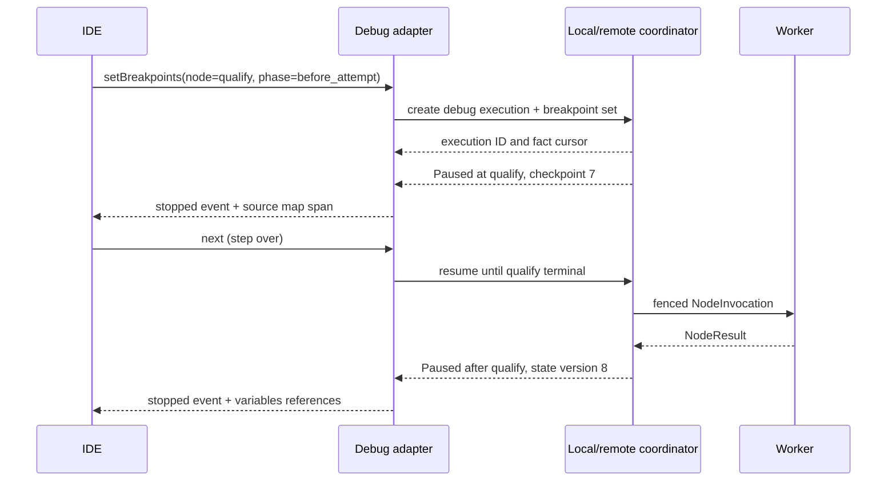

# 8. Developer Experience

## 8.1 One intermediate representation, multiple authoring surfaces

The CLI, SDKs, YAML, JSON, visual editor, and API all compile to the same versioned Graph IR. No surface has private runtime semantics.

```text
TypeScript/Rust builders ----+
YAML/JSON -------------------+--> parse --> normalize --> type/effect/policy compile --> Graph IR
Visual collaborative draft --+                         |                         |
Graph DSL -------------------+                         |                         +--> executable plan
                                                        +--> source map + diagnostics
```

Normative rules:

1. Graph IR JSON is the canonical document form; deterministic CBOR is used for content hashing. YAML and DSL are authoring projections.
2. Stable node and edge IDs survive every lossless round trip. Formatting, comments, source spans, and editor coordinates live in a source-map/editor-metadata section excluded from the executable-plan digest.
3. Every compiler diagnostic has stable `code`, `severity`, logical resource location, and zero or more source spans. CLI, IDE, web editor, and CI display the same fact.
4. All build inputs resolve to exact digests: node definitions, plugins, subgraphs, schemas, prompts, policy bundles, model routes, and compiler version.
5. Publication is a remote command against a content digest. Building locally never grants deployment or remote execution authority.

## 8.2 Toolchain and compatibility

The versioned toolchain consists of `ege` CLI, compiler, local daemon, language SDK, generated API client, plugin SDK, and IDE extension. The repository lock records exact compatibility:

```yaml
# ege.lock; generated, committed, and verified in CI
lockVersion: 1
compiler: egec/1.8.2
graphApi: ege.dev/v1
packages:
  core/nodes: { version: 2.6.0, digest: "sha256:719a...75e2" }
  acme/crm: { version: 1.4.3, digest: "sha256:13df...0ad9" }
schemas:
  acme/Lead: { version: 3.1.0, digest: "sha256:a019...d2cc" }
plugins:
  acme/salesforce: { version: 4.0.1, digest: "sha256:805e...22f9" }
```

The CLI negotiates server API and feature ranges before mutation. A newer server can serve older APIs; an older client refuses a command requiring unsupported semantics and prints the minimum client version. `--force` never bypasses schema, policy, or compatibility checks.

## 8.3 CLI

The binary is `ege`. Human output defaults to concise tables; `--output json` emits one documented schema to stdout and sends progress to stderr. Exit codes are stable: `0` success, `2` user/config error, `3` compile/validation failure, `4` authorization/policy denial, `5` remote unavailable, `6` execution/test failure, `7` partial bulk result.

### 8.3.1 Command surface

| Command | Purpose and important guarantees |
|---|---|
| `ege init` | Create graph workspace, config, lockfile, example, and test directories without overwriting existing files |
| `ege auth login/logout/status` | OIDC device/PKCE login or workload identity status; tokens stored in OS keychain, never plaintext config |
| `ege context list/use/show` | Select named organization/project/environment endpoint; every mutation prints selected scope |
| `ege graph fmt/lint/validate/build` | Parse, canonicalize, compile, and emit IR/plan/source map; offline validation is explicitly labeled partial |
| `ege graph diff` | Semantic diff source/draft/version/digest; supports `--fail-on breaking,capability,cost` |
| `ege graph push/pull/publish` | Synchronize drafts or create immutable version with compare-and-swap and idempotency key |
| `ege deploy plan/apply/status/rollback` | Produce reviewed environment plan, apply exact plan digest, observe rollout, or create rollback deployment |
| `ege run start/watch/cancel/replay` | Start a version, stream resumable facts, request cancellation, or fork from checkpoint |
| `ege debug` | Start local/remote debug execution and Debug Adapter Protocol session |
| `ege test` | Run unit, graph, integration, golden, snapshot, and simulation suites with deterministic reports |
| `ege dev` | Start local daemon, file watcher, UI, plugin hosts, and hot reload |
| `ege package add/update/remove/why` | Resolve node/subgraph/plugin packages, update lock, and explain transitive dependency |
| `ege plugin build/test/sign/publish` | Invoke the governed plugin toolchain described in Chapter 13 |
| `ege schema pull/generate/check` | Sync schemas, generate types/fixtures, and report compatibility |
| `ege api generate` | Generate clients from a pinned OpenAPI/Graph schema artifact |
| `ege doctor` | Check runtime, container/Wasm support, endpoint, clock skew, certificate, and tool versions with redacted output |

### 8.3.2 Repeatable workflow

```bash
ege graph fmt graphs/lead-routing.ege.yaml --check
ege graph validate graphs/lead-routing.ege.yaml --locked --environment staging
ege test --suite graph --seed 441917 --report junit:artifacts/graph-tests.xml
ege graph diff graphs/lead-routing.ege.yaml remote:graphs/lead-routing@42 --fail-on breaking,capability
ege graph publish graphs/lead-routing.ege.yaml --expected-draft-seq 1842 --message "Add CRM timeout route"
ege deploy plan graphs/lead-routing@43 --environment staging --out artifacts/deploy-plan.json
ege deploy apply artifacts/deploy-plan.json --require-digest sha256:21ae...f901
```

Commands accepting secrets take secret reference names or stdin/file descriptors for creation. Secret values are not accepted as flags because shell history and process lists expose them. Diagnostics redact credentials, signed URLs, prompts, headers, and values labeled confidential.

## 8.4 Workspace configuration

```text
lead-automation/
  ege.work.yaml           # non-secret workspace and source roots
  ege.lock                # exact package/schema/plugin/compiler resolutions
  graphs/
    lead-routing.ege.yaml
  src/
    lead-routing.graph.ts
  schemas/
    lead.schema.json
  prompts/
    qualify.prompt.md
  tests/
    unit/
    graph/
    integration/
    golden/
    snapshots/
    fixtures/
  mocks/
    crm.mock.yaml
  .ege/
    cache/                # ignored; content-addressed and safe to delete
    local.db              # ignored; local execution facts/checkpoints
```

```yaml
# ege.work.yaml
apiVersion: ege.dev/toolchain/v1
kind: Workspace
metadata: { name: lead-automation }
spec:
  sources: [graphs, src]
  schemaRoots: [schemas]
  promptRoots: [prompts]
  defaultGraph: acme/lead-routing
  local:
    runtime: container
    artifactStore: .ege/artifacts
    redact: strict
  remoteContexts:
    staging:
      endpoint: https://api.staging.ege.example
      organization: 019fd4b4-4000-7000-8000-000000000001
      project: 019fd4b4-4000-7000-8000-000000000002
      environment: env_staging
```

Remote context contains identifiers and certificate/keychain aliases only. Environment-specific model routes, database bindings, and secrets are deployment bindings, not substitutions that rewrite a graph document.

## 8.5 Graph DSL, YAML, and JSON

### 8.5.1 DSL grammar

The DSL is declarative and expression-limited. It has no network, filesystem, clock, reflection, or general-purpose loops at compile time.

```ebnf
graph       = "graph", qualified_name, [ "version", string ], "{", { declaration }, "}" ;
declaration = input | output | state | node | edge | policy | export ;
node        = "node", identifier, ":", package_ref, [ config ], [ bindings ], ";" ;
edge        = endpoint, ( "->" | "~>" ), endpoint, [ "when", expression ], ";" ;
endpoint    = identifier, ".", identifier ;
config      = "with", object ;
bindings    = "bind", object ;
package_ref = qualified_name, "@", semver_or_digest ;
expression  = literal | path | call | unary | binary | conditional ;
path        = ( "inputs" | "state" | "nodes" | "local" ), { ".", identifier } ;
```

`->` is a data edge and `~>` is a control edge. Expressions call only compiler-registered pure functions such as `coalesce`, `size`, and `redact`; they cannot invoke tools or user code.

```text
graph acme/lead-routing {
  input lead: schema acme/Lead@3;
  node render: builtin://prompt@1.7.0 with { template: "prompts/qualify@9" }
    bind { variables: inputs.lead };
  node qualify: builtin://llm@2.3.1 with {
    modelRoute: "fast-structured@4",
    responseSchema: "acme/Qualification@2"
  } bind { messages: nodes.render.messages };
  node route: builtin://switch@1.2.0 with {
    cases: [{ id: "sales", when: nodes.qualify.score >= 0.8 }],
    default: "nurture"
  };
  render.messages -> qualify.messages;
  qualify.result -> route.value;
  output decision = nodes.qualify.result;
}
```

### 8.5.2 YAML authoring form

YAML is strict: duplicate keys, implicit timestamps, anchors that create cycles, and custom tags are rejected. Scalars are decoded using the YAML 1.2 JSON schema, preventing `on`, `off`, and leading-zero surprises.

```yaml
apiVersion: executiongraph.io/v1
kind: Graph
metadata:
  namespace: acme
  name: lead-routing
  version: 1.0.0
spec:
  inputs:
    - name: lead
      schema: registry://acme/Lead@3
      classification: CONFIDENTIAL
  outputs:
    - name: decision
      schema: registry://acme/Qualification@2
      classification: CONFIDENTIAL
  state:
    schema:
      type: object
      additionalProperties: false
      properties:
        decision: { $ref: "registry://acme/Qualification@2" }
    paths:
      - path: /decision
        mutability: SINGLE_ASSIGNMENT
        writers: [qualify]
        classification: CONFIDENTIAL
  nodes:
    - id: render
      type: builtin://prompt@1.7.0
      inputs:
        - { name: variables, schema: "registry://acme/Lead@3", classification: CONFIDENTIAL }
      outputs:
        - name: messages
          schema: { type: array, items: { type: object } }
          classification: CONFIDENTIAL
      config: { template: prompts/qualify@9, variablesSource: "$graph.inputs.lead" }
      effect: { class: PURE, deliveryContract: NO_EFFECT }
    - id: qualify
      type: builtin://llm@2.3.1
      inputs:
        - name: messages
          schema: { type: array, items: { type: object } }
          classification: CONFIDENTIAL
      outputs:
        - { name: result, schema: "registry://acme/Qualification@2", classification: CONFIDENTIAL }
      config:
        modelRoute: fast-structured@4
        responseSchema: registry://acme/Qualification@2
      effect: { class: READ_ONLY, deliveryContract: READ_ONLY_REPEATABLE }
  edges:
    - id: render_to_qualify
      kind: DATA
      from: { node: render, port: messages }
      to: { node: qualify, port: messages }
  budgets:
    timeout: PT2M
    maxCostMicrounits: 250000
    maxStateBytes: 1048576
    maxChildren: 32
```

### 8.5.3 Canonical JSON projection

```json
{
  "apiVersion": "executiongraph.io/v1",
  "kind": "Graph",
  "metadata": { "name": "lead-routing", "namespace": "acme", "version": "1.0.0" },
  "spec": {
    "inputs": [
      {
        "name": "lead",
        "schema": "registry://acme/Lead@3",
        "classification": "CONFIDENTIAL"
      }
    ],
    "outputs": [
      {
        "name": "decision",
        "schema": "registry://acme/Qualification@2",
        "classification": "CONFIDENTIAL"
      }
    ],
    "state": {
      "schema": {
        "type": "object",
        "additionalProperties": false,
        "properties": {
          "decision": { "$ref": "registry://acme/Qualification@2" }
        }
      },
      "paths": [
        {
          "path": "/decision",
          "mutability": "SINGLE_ASSIGNMENT",
          "writers": ["qualify"],
          "classification": "CONFIDENTIAL"
        }
      ]
    },
    "nodes": [
      {
        "id": "render",
        "type": "builtin://prompt@1.7.0",
        "inputs": [
          {
            "name": "variables",
            "schema": "registry://acme/Lead@3",
            "classification": "CONFIDENTIAL"
          }
        ],
        "outputs": [
          {
            "name": "messages",
            "schema": { "type": "array", "items": { "type": "object" } },
            "classification": "CONFIDENTIAL"
          }
        ],
        "config": { "template": "prompts/qualify@9", "variablesSource": "$graph.inputs.lead" },
        "effect": { "class": "PURE", "deliveryContract": "NO_EFFECT" }
      },
      {
        "id": "qualify",
        "type": "builtin://llm@2.3.1",
        "inputs": [
          {
            "name": "messages",
            "schema": { "type": "array", "items": { "type": "object" } },
            "classification": "CONFIDENTIAL"
          }
        ],
        "outputs": [
          {
            "name": "result",
            "schema": "registry://acme/Qualification@2",
            "classification": "CONFIDENTIAL"
          }
        ],
        "config": {
          "modelRoute": "fast-structured@4",
          "responseSchema": "registry://acme/Qualification@2"
        },
        "effect": { "class": "READ_ONLY", "deliveryContract": "READ_ONLY_REPEATABLE" }
      }
    ],
    "edges": [
      {
        "id": "render_to_qualify",
        "kind": "DATA",
        "from": { "node": "render", "port": "messages" },
        "to": { "node": "qualify", "port": "messages" }
      }
    ],
    "budgets": {
      "timeout": "PT2M",
      "maxCostMicrounits": 250000,
      "maxStateBytes": 1048576,
      "maxChildren": 32
    }
  }
}
```

JSON is best for APIs and generated artifacts. YAML is best for hand-maintained declarative graphs. The compact DSL is best for reviewing topology-heavy graphs. None accepts resolved secret values.

## 8.6 Code-first graphs

SDK builders create the same document and source map; user code is run only during compilation in a hermetic build process. A graph definition must not depend on current time, random global state, network calls, or machine-specific paths.

```ts
import { defineGraph, input, node, output, schema } from "@ege/sdk";

const Lead = schema.ref<Lead>("acme/Lead@3");
const Qualification = schema.ref<Qualification>("acme/Qualification@2");

export default defineGraph({ namespace: "acme", name: "lead-routing", version: "1.0.0" }, (g) => {
  const lead = input(g, "lead", Lead);
  const render = node(g, "render", "builtin://prompt@1.7.0", {
    config: { template: "prompts/qualify@9" },
    inputs: { variables: lead }
  });
  const qualify = node(g, "qualify", "builtin://llm@2.3.1", {
    config: {
      modelRoute: "fast-structured@4",
      responseSchema: Qualification.ref
    },
    inputs: { messages: render.outputs.messages }
  });
  output(g, "decision", qualify.outputs.result.as(Qualification));
});
```

Generated port types come from pinned node definitions. A changed dependency cannot silently regenerate a different graph because `ege.lock` is mandatory under `--locked`. The SDK uses explicit IDs rather than deriving identity from source line numbers; refactoring a file does not appear as delete-and-add.

Rust supports service and worker authors with typed builders:

```rust
let graph = Graph::builder("acme", "batch-rank")
    .input::<CandidateBatch>("candidates", "acme/CandidateBatch@1")?
    .node(Reranker::new("rank", "builtin://reranker@1.5.0")
        .model_route("rerank-balanced@2")
        .top_n(20)
        .bind("candidates", PortRef::graph_input("candidates")))?
    .output("ranked", PortRef::node("rank", "ranked"))?
    .build()?;
graph.write_canonical_json(std::io::stdout())?;
```

## 8.7 Visual-first and round-trip behavior

The visual editor saves GraphSpec source plus the schema-permitted `editor` metadata. Publishing freezes that source and compiles immutable Graph IR. Export to YAML/JSON is lossless for GraphSpec semantics and stable IDs; exporting to DSL can be lossy for free-form comments and complex editor layout, and the UI warns before replacing a source-owned file.

Source ownership is explicit:

```yaml
metadata:
  source:
    mode: code-first          # code-first | file-first | visual-first
    uri: src/lead-routing.graph.ts
    generatedAtDigest: sha256:f2ab...09ce
```

- **Code-first:** web edits create an overlay patch or a branch proposal; they never rewrite TypeScript/Rust. The developer applies the semantic patch in source and recompiles.
- **File-first:** YAML/DSL and web editor may round-trip if the formatter/source-map can preserve the change. Concurrent Git and web edits use a semantic three-way merge.
- **Visual-first:** the collaborative draft is authoritative; export is a reviewed snapshot. CI can pull by immutable draft sequence/version.

This avoids the anti-pattern where a generated source file and canvas overwrite one another based on timestamps.

## 8.8 REST control API

`docs/contracts/control-plane.openapi.yaml` is the **sole normative source** for public REST servers, paths, operation IDs, parameters, schemas, status codes, and generated clients. This chapter explains the developer experience but does not define additional routes. A CLI command may compose several normative operations or run a local compiler workflow; its name does not imply another public endpoint.

REST commands are resource-oriented and idempotent where retry is expected. The current normative v1 surface is:

| Method and path | Semantics |
|---|---|
| `POST /v1/projects/{projectId}/graphs` | `createGraph`: create graph identity and its initial immutable source version |
| `POST /v1/graphs/{graphId}/versions` | `createGraphVersion`: commit a new immutable source version from direct GraphSpec or an authorized draft head |
| `POST /v1/graphs/{graphId}/versions/{versionId}:compile` | `compileGraphVersion`: compile the exact source version and return diagnostics/plan identity |
| `POST /v1/environments/{environmentId}/deployments` | `publishDeployment`: publish an admitted immutable plan and traffic decision |
| `POST /v1/deployments/{deploymentId}/executions` | `startExecution`: durably admit a typed execution under an idempotency key |
| `GET /v1/executions/{executionId}` | `getExecution`: read canonical status and watermarks |
| `POST /v1/executions/{executionId}:cancel` | `cancelExecution`: request durable cooperative cancellation |
| `POST /v1/executions/{executionId}:replay` | `replayExecution`: state-rebuild, exactly replay, or fork at a content-bound source history boundary |
| `POST /v1/executions/{executionId}/signals/{signalName}` | `signalExecution`: correlate a typed idempotent signal |
| `GET /v1/executions/{executionId}/history` | `listExecutionHistory`: cursor-page authorized canonical history |
| `POST /v1/approvals/{approvalId}:resolve` | `resolveApproval`: resolve the exact content-bound proposal |

```http
POST /v1/deployments/019fd4b4-4000-7000-8000-000000000101/executions
Authorization: Bearer eyJ...
Idempotency-Key: 019fd4b4-4000-7000-8000-000000000201
Content-Type: application/json

{
  "input": { "leadId": "L-1842", "region": "JP" },
  "labels": { "source": "developer-portal" },
  "budget_override": { "max_cost_microunits": 250000, "timeout": "PT2M" }
}
```

```json
{
  "type": "https://errors.execution-graph.example/validation-failed",
  "title": "Execution input failed validation",
  "status": 422,
  "code": "INPUT_SCHEMA_VALIDATION_FAILED",
  "detail": "The submitted input does not satisfy the deployment's pinned input schema.",
  "trace_id": "4bf92f3577b34da6a3ce929d0e0e4736",
  "violations": [
    { "pointer": "/input/region", "code": "ENUM", "message": "Value is not in the allowed set." }
  ]
}
```

History pagination uses the OpenAPI `after_sequence` and `limit` parameters and returns `next_after_sequence`. API versions are additive within a major version; removing a field, narrowing a schema, or changing default semantics requires a new major version and deprecation window. Any future route first lands in the OpenAPI contract and compatibility checks before it appears in CLI/SDK documentation.

## 8.9 Graph API

The Graph API is an optional projection-oriented GraphQL endpoint for explorers, dashboards, dependency traversal, and inspectors. It does not execute arbitrary graph database queries, does not define control-plane commands, and is not the execution graph DSL. Mutating business commands remain the operations generated from the normative OpenAPI.

The query below is an **illustrative, non-normative read-model schema**. Its fields are not additions to the REST contract; a production GraphQL schema is separately versioned, generated, authorized, and compatibility-tested.

```graphql
query ExecutionCriticalPath($id: ExecutionID!, $after: Cursor) {
  execution(id: $id) {
    id
    status
    graphVersion { number documentDigest planDigest }
    nodeAttempts(first: 100, after: $after, orderBy: START_SEQUENCE) {
      pageInfo { endCursor hasNextPage }
      nodes {
        nodeId attempt status queuedMs runMs costMicrounits
        error { code category retryable }
      }
    }
  }
}
```

Queries have depth, complexity, row, and time budgets. Field authorization is resolver-enforced and loaders batch backend access. Persisted queries are required for browser production traffic. Subscriptions emit sequence pointers and summaries; clients fetch authorized canonical history to fill gaps.

## 8.10 SDKs

Supported first-party SDKs are TypeScript, Python, Rust, Go, and Java. Each provides:

- generated control API clients, retry and idempotency helpers, cursor iterators, and resumable execution-history streams;
- typed Graph IR builders and schema-generated port types where the language supports them;
- local test harness, fixtures, mocks, simulation clock, and trace capture;
- worker/plugin protocol support with heartbeat, cancellation, artifact streaming, and secret handles;
- OpenTelemetry propagation and safe diagnostic types;
- no implicit retry of non-idempotent commands or node effects.

```ts
// Ergonomic SDK wrappers below are generated from the OpenAPI operationIds
// startExecution and listExecutionHistory; they do not call separate routes.
const execution = await client.executions.start(
  {
    deploymentId: "019fd4b4-4000-7000-8000-000000000101",
    input: lead,
    budgetOverride: { timeout: "PT2M", maxCostMicrounits: 250_000n }
  },
  { idempotencyKey: uuidv7(), signal }
);

for await (const event of client.executions.history(execution.id, { resume: true, signal })) {
  checkpointStore.set(execution.id, event.sequence);
  if (event.eventType === "ExecutionTerminal") break;
}
```

SDK retries only safe GETs and commands carrying an idempotency key, honors `retry-after`, uses full jitter, bounds attempts/deadline, and exposes the final request ID. Logging hooks receive redacted metadata, not request bodies.

## 8.11 Local and remote runtimes

### 8.11.1 Local daemon

`ege dev` starts a single-user control plane with the production compiler and coordinator libraries, SQLite/PostgreSQL-compatible event store, filesystem/S3-compatible artifact adapter, local queue, Wasm/container plugin hosts, and web workbench. The daemon binds loopback by default and issues an ephemeral per-process session token. The default browser flow requires no account, login screen, organization, RBAC or external identity provider; the workbench bootstraps this local process session automatically.

Tokenless local mode is not a normal release profile. If explicitly enabled for an
isolated development fixture, the daemon MUST refuse non-loopback binding, reject
non-loopback `Host` values, enforce an exact same-origin allowlist for every mutation,
keep provider credentials server-side, and show a persistent unsafe-mode warning. CORS
wildcards do not make a localhost code-execution service safe. Workspace-writing model
or CLI execution remains a separate explicit capability even in single-user mode.

```text
CLI / IDE / browser
       |
   local API
       |
 compiler -- coordinator -- virtual/real scheduler
       |          |                 |
 artifact dir   local DB       worker/plugin hosts
```

Local parity means identical Graph IR, node protocol, lifecycle, error codes, replay rules, and compiler. It does not claim parity for cloud IAM, provider capacity, distributed races, managed database behavior, Kubernetes eviction, or organization policy. `ege test --remote staging` exists for governed integration evidence.

### 8.11.2 Remote execution

Remote mode uploads missing content-addressed artifacts, validates the exact graph digest against environment bindings, then creates an execution. The CLI never ships local source directories or ambient environment variables. Remote worker logs and artifacts obey tenant retention and payload permissions.

## 8.12 Hot reload

The watcher parses changed sources, computes a semantic diff, and assigns a reload class:

| Change class | Running debug execution | New local executions |
|---|---|---|
| Comments, layout, source formatting | UI refresh only | Use updated document metadata |
| Pure node config or prompt used by a not-yet-started node | Optional debug fork at current checkpoint after validation | Use newly compiled plan |
| Topology, port schema, state schema, loop/effect policy | Existing execution remains pinned; offer restart or fork from compatible checkpoint | Use new plan after compile |
| Plugin/runtime/dependency digest | Drain matching local warm hosts; existing attempt finishes pinned digest | Start new sandbox with new digest |
| Deployment binding or secret metadata | Never hot-substitute into an execution | Re-admit next execution |

Production deployments never hot reload. A debug fork records old/new plan digests, checkpoint, overrides, and compatibility proof. A failed compile leaves the last good local plan running and surfaces diagnostics; it does not partially replace nodes.

## 8.13 Live debugging protocol

The IDE integration speaks Debug Adapter Protocol to an `ege debug-adapter`, which translates user actions to coordinator commands. Breakpoints are durable runtime objects, not worker process breakpoints.



Variables requests are paginated and sensitivity-aware. Conditional breakpoints use the restricted expression language. Evaluate requests cannot run arbitrary code against remote workers. Step into enters a subgraph or agent/tool child execution; step over waits for the selected node's semantic terminal fact; step out runs until the parent subgraph returns.

## 8.14 Testing model

### 8.14.1 Test layers

| Layer | Subject | External behavior | Required assertions |
|---|---|---|---|
| **Unit** | Pure function, expression, prompt renderer, mapper, validator, plugin handler | No runtime; all I/O prohibited/mocked | Values, schemas, errors, determinism, property/fuzz cases |
| **Node contract** | One NodeDefinition through worker protocol | Fake coordinator/artifact/secret broker | Port/config validation, cancellation, timeout, capability denial, serialization, retry taxonomy |
| **Graph** | Compiled topology and state transitions | Deterministic fake adapters | Paths, joins, loop bounds, state deltas, error routes, budgets, invariants |
| **Integration** | Real adapter/provider sandbox | Explicit opt-in, isolated tenant/resources | Auth, protocol, idempotency, schema drift, cleanup, failure behavior |
| **Simulation** | Large/run-many behavior under virtual conditions | Virtual clock, seeded faults and latency | Queueing, critical path, cost distributions, backpressure, recovery |
| **End-to-end** | UI/CLI through deployed test environment | Managed test dependencies | Author-publish-deploy-run-debug-audit journey and accessibility |

### 8.14.2 Graph test specification

```yaml
apiVersion: ege.dev/testing/v1
kind: GraphTest
metadata: { name: high-score-goes-to-sales }
spec:
  graph: ../../graphs/lead-routing.ege.yaml
  seed: 441917
  clock: { start: "2026-08-06T00:00:00Z", mode: virtual }
  input:
    schema: acme/Lead@3
    value: { leadId: L-1842, region: JP }
  mocks:
    - match: { nodeId: qualify, call: 1 }
      return:
        result: { score: 0.91, reason: strong_fit }
        usage: { inputTokens: 120, outputTokens: 18, costMicrounits: 850 }
  expect:
    status: completed
    path: [render, qualify, route, sales]
    state:
      jsonPath:
        "$.decision": { equals: sales }
    budgets:
      maxIterations: 1
      maxCostMicrounits: 1000
    invariants:
      - "count(events.where(kind == 'ExternalEffect')) == 0"
```

Mocks match stable node ID, definition digest or capability, semantic call count, and schema-bound predicate. Broad “mock every HTTP call” rules are rejected because they can hide a newly added effect. Unmatched effects fail closed in tests.

### 8.14.3 Simulation and fault injection

The simulator uses the production compiler and coordinator state machine with a virtual scheduler. It can seed:

- provider latency/rate-limit/error distributions;
- queue delay, worker loss, lease expiry, duplicate delivery and late result;
- artifact-store timeout/corruption, state conflicts, policy revocation, and secret expiry;
- fan-out cardinality, input size, cache hit rate, and human response distributions;
- cancellation and regional failure at exact fact sequences.

Runs emit normal execution facts and can be inspected in the same UI. Simulation cannot establish provider semantic quality or real infrastructure capacity; reports label modeled assumptions and confidence intervals.

### 8.14.4 Golden and snapshot tests

Golden tests assert intentional semantic output for stable curated fixtures: normalized structured answer, selected path, policy decision, or compiled Graph IR. Snapshot tests capture broad developer-facing structures such as diagnostics, source maps, manifest rendering, or UI component states.

Rules:

- Normalize nondeterministic IDs/timestamps only through named serializers. Never regex away arbitrary differences.
- LLM goldens pin route/model and either use recorded provider responses or an evaluation tolerance with reviewer-approved rubric. Exact prose equality is usually invalid.
- Snapshot changes fail CI and require `ege test --update-snapshots --review`; CI itself cannot update files.
- Every golden records graph/compiler/plugin/schema/model or fixture digests and seed.
- Secrets, personal data, production prompts, and unrestricted execution payloads cannot become fixtures.

### 8.14.5 Property and replay tests

Runtime-critical suites generate graphs and event histories to assert:

- a stale lease never commits;
- replaying committed facts yields the same execution/state projection;
- cancellation is terminal even if a late worker succeeds;
- Merge finishes after every branch has an explicit terminal marker;
- state compare-and-set never silently overwrites conflict;
- compiler normalization and JSON/YAML/code-first round trips preserve semantic digest;
- adding independent parallel scheduling permutations does not change deterministic outputs.

## 8.15 CI contract

```yaml
steps:
  - run: ege graph fmt --check graphs src
  - run: ege package verify --locked --signatures required
  - run: ege graph validate --all --offline-policy-cache ci/policy-bundle.tar
  - run: ege test --suite unit,node,graph,golden,snapshot --seed 441917 --report junit:artifacts/ege.xml
  - run: ege graph diff remote:main source:. --fail-on breaking,capability --output sarif > artifacts/ege.sarif
  - run: ege deploy plan source:. --environment staging --out artifacts/deploy-plan.json
```

Offline policy evaluation states the policy bundle digest and cannot claim current remote admission. A deploy plan expires when graph, environment binding, policy epoch, plugin trust, or model route changes.

## 8.16 Decisions and trade-offs

| Decision | Why | Alternative | Trade-off |
|---|---|---|---|
| One Graph IR for every surface | Prevents semantics drifting between UI, code, CLI and API | Separate UI/runtime formats | Compiler and source maps are complex; interoperability and repeatability improve substantially |
| Hermetic code-first compile | Reproducible, reviewable graph generation | Execute arbitrary application code during deploy | Builders are less dynamic; dynamic behavior belongs in runtime graph generation with policy/bounds |
| REST commands and projection GraphQL | Explicit idempotency/audit for actions, flexible reads | One GraphQL API | Two generated clients; clearer operational semantics and bounded query execution |
| Durable coordinator debugging | Works across distributed workers, waits and retries | Attach debugger to worker process | Cannot evaluate arbitrary process memory; debugging reflects real semantic execution |
| Production pinning; hot reload only via debug fork | Historical truth and effects remain attributable | Mutate running plan | Slower edit loop for topology changes; eliminates mixed-version executions |
| Virtual-time simulator reuses state machine | Finds scheduling/recovery defects rapidly and repeatably | Bespoke simplified simulator | Adapters still need models and real integration tests; core semantics remain aligned |
| Strict YAML subset and deterministic JSON | Stable hashes and cross-language parsing | Accept parser-specific YAML features | Less YAML convenience; fewer supply-chain and interpretation surprises |

## 8.17 Patterns and anti-patterns

**Patterns:** committed lockfile; content-addressed build cache; generated types from pinned schemas; source maps for every node/binding; command idempotency keys; cursors for streams; explicit debug forks; virtual clock and seed; schema-aware mocks; semantic diffs in CI; sanitized reproduction bundles.

**Anti-patterns:** SDK-only runtime behavior; compiling from unpinned `latest`; source-line-derived node IDs; deployment-time arbitrary code; shell flags containing secrets; implicit retry of POST/effects; mocks that match all network traffic; snapshotting timestamps and random IDs then ignoring churn; remote “evaluate expression” that runs arbitrary code; hot patching a production execution; treating successful local simulation as production acceptance.

## 8.18 Developer experience acceptance criteria

- YAML, JSON, DSL, TypeScript builder, Rust builder, and visual export compile to the same semantic digest for an equivalent graph.
- A CLI process interrupted after submitting an idempotent execution or publish command can retry and recover the original result without creating a duplicate.
- The IDE can set a node breakpoint, disconnect, reconnect, and resume from durable execution facts without retaining a worker.
- Tests fail when any unmocked external capability is attempted, when a mock violates a port schema, or when golden dependency digests drift.
- Hot reload never changes a running production execution and never leaves a local execution with a partially replaced plan.
- REST, Graph API, and SDK payload access is field-authorized; request IDs and stable error codes appear consistently in CLI, IDE, and web diagnostics.
